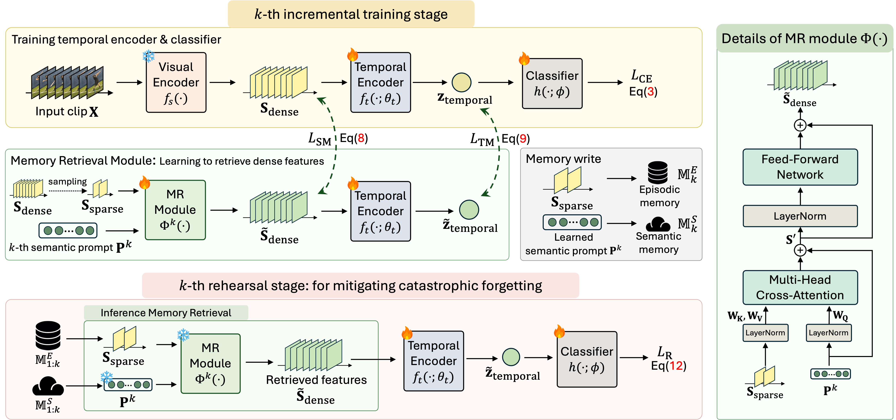

<!-- # [🎥 ICCV2025] ESSENTIAL: Episodic and Semantic Memory Integration for Video Class-Incremental Learning

[](https://iccv.thecvf.com/)   [](https://arxiv.org/abs/2508.10896)   [](https://jong980812.github.io/ESSENTIAL/)   [](https://vll.khu.ac.kr/) 


---

<p align="center">
  
</p>

---
## 👨‍💻 Authors

| [Jongseo Lee<sup>1*</sup>](https://jong980812.github.io/) | [Kyungho Bae<sup>2*</sup>](https://github.com/Backdrop9019) | [Kyle Min<sup>3</sup>](https://sites.google.com/view/kylemin) | [Gyeong-Moon Park<sup>4†</sup>](https://gyeongmoon.github.io/) | [Jinwoo Choi<sup>1†</sup>](https://sites.google.com/site/jchoivision/) |
|---|---|---|---|---|

<sup>*</sup> Equal contribution, <sup>†</sup> Corresponding author
## 📜 License
This work is licensed under a [Creative Commons Attribution 4.0 International License (CC BY 4.0)](https://creativecommons.org/licenses/by/4.0/).

## 📌 Highlight
- **Accepted at ICCV 2025 (Highlight Presentation)**
- Proposes **ESSENTIAL**, a framework inspired by human memory that integrates **episodic and semantic memory** for **video class-incremental learning (VCIL)**.
- Achieves a **favorable trade-off** between memory efficiency and recognition performance compared to prior VCIL methods.
- Code release includes **training, evaluation, and visualization tools**.

## 📑 Contents
- [Installation](#-installation)
- [Dataset](#-dataset)
- [Training](#-training)
- [Evaluation](#-evaluation)

## 🚀 Installation

We recommend using **conda** to create a clean environment.  
The code has been tested with **Python 3.8**, **PyTorch 2.0.1**, and **CUDA 11.7**.

### Step 1. Create conda environment
```bash
conda create -n ESSENTIAL python=3.8 -y
conda activate ESSENTIAL
conda install pytorch==2.0.1 torchvision==0.15.2 torchaudio==2.0.2 pytorch-cuda=11.7 -c pytorch -c nvidia
pip install -r requirements.txt
```
## 📂 Dataset

We provide the annotation files for ESSENTIAL on [Hugging Face Hub](https://huggingface.co/datasets/KHUjongseo/ESSENTIAL/tree/main).

### Step 1. Download annotations
Please download the annotation files from the link above.

### Step 2. Organize dataset
Place the downloaded files under the `./data/` directory as follows:
```
ESSENTIAL/
│── data/
│   ├── clip_temporal.pth
│   ├── TCD/
│   │   ├── ...
│   │   └── 
│   ├── vCLIMB/
│   │   ├── ...
│   │   └── 
│   └── …
```
### Step 3. Prepare raw videos
- The benchmark datasets (e.g., Kinetics-400) should be downloaded separately.  
## 🎯 Training

We provide training scripts for two representative benchmarks:

- **TCD (Something-Something V2 based)**: [`scripts/ssv2_final.sh`](./scripts/ssv2_final.sh)  
- **vCLIMB (UCF101 based)**: [`scripts/ucf_final.sh`](./scripts/ucf_final.sh)  

These scripts contain the recommended hyperparameters and configurations for each benchmark.  
For other datasets, please adapt the script by changing the following arguments:

- `--data_set` : the dataset name (e.g., `SSV2`, `UCF101`, `Kinetics400`)  
- `--anno_path` : the path to the corresponding annotation file (e.g., `ESSENTIAL/data/TCD/...pkl`)  
- `--num_tasks` : the number of incremental tasks for the experiment  

By modifying these options, the same framework can be applied to various datasets under different class-incremental learning scenarios.

## 📊 Evaluation

To evaluate a trained model, specify the path to the experiment folder using:

- `--fine_tune_path` : path to the folder containing the trained checkpoints  

For evaluation-only mode, enable the following flags:

- `--no_training` : disable further training  
- `--no_rehearsal` : disable rehearsal during evaluation  

With these options, ESSENTIAL will load the trained checkpoints and report performance without performing additional training or rehearsal.

## 📝 Note

For the convenience of follow-up research and reproducibility,  
we implemented ESSENTIAL to store tokens in memory during training and evaluation,  
instead of directly saving them into files.  
This design choice makes it easier for others to adapt the codebase for new experiments and extend it to different research directions. -->


# 🚨Repository Moved!
>
> This project has been moved to the official KHU-VLL organization:  
> 👉 [https://github.com/KHU-VLL/ESSENTIAL](https://github.com/KHU-VLL/ESSENTIAL)
>
> Please update your bookmarks, stars, and links accordingly.  
> Future updates and issues will be managed **only on the new repository**.