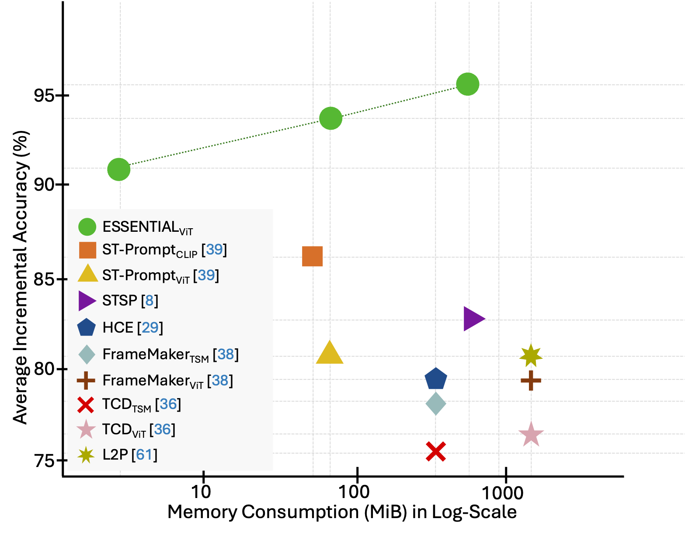
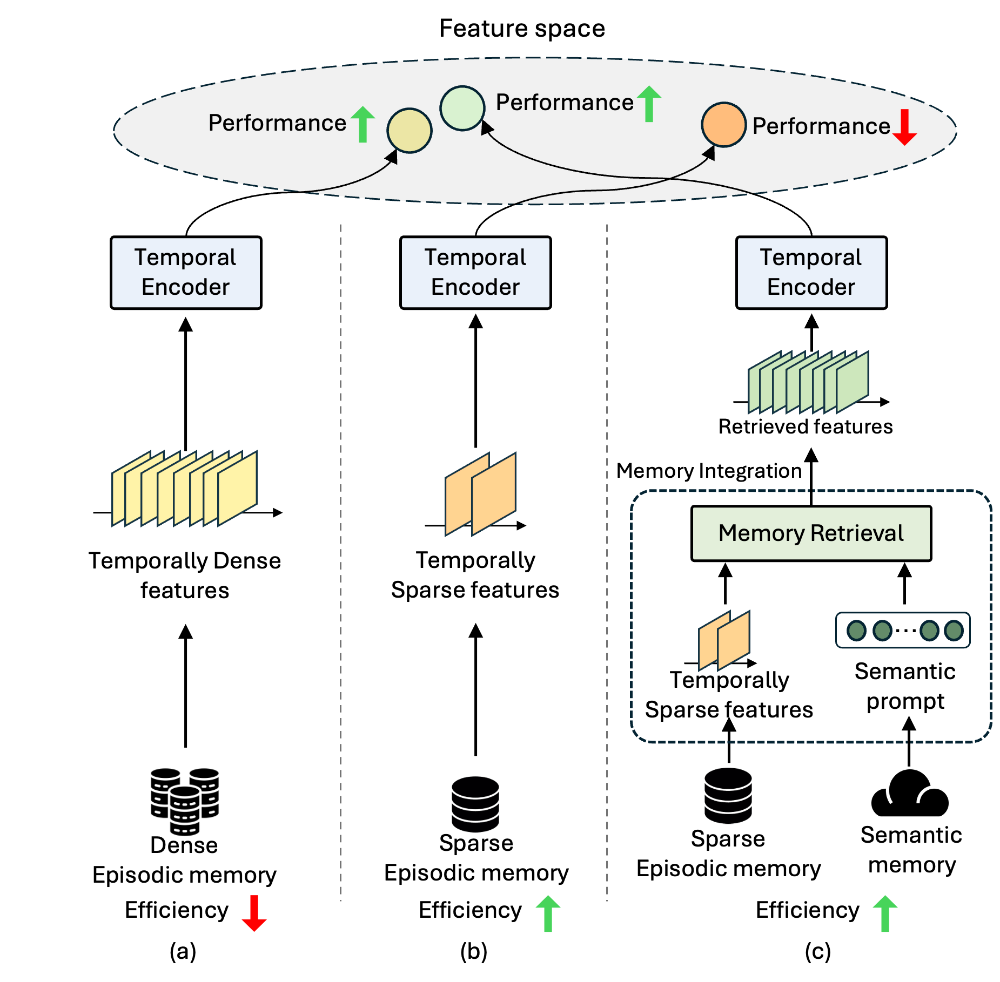
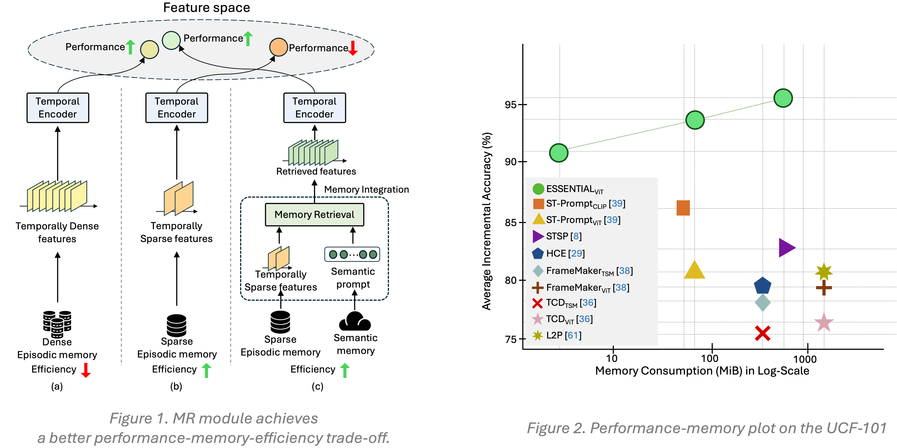
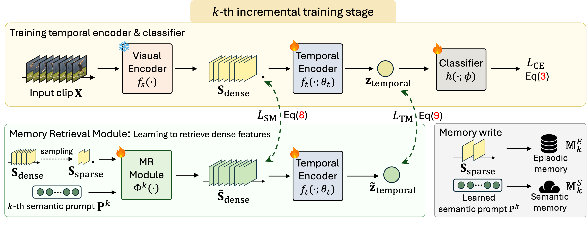
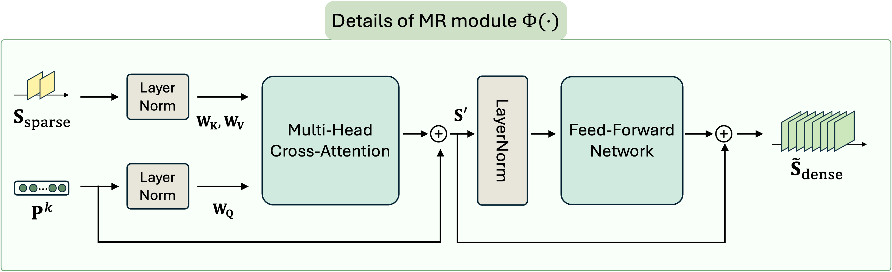
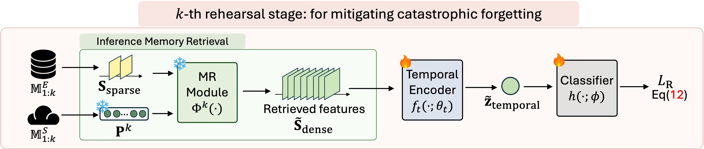
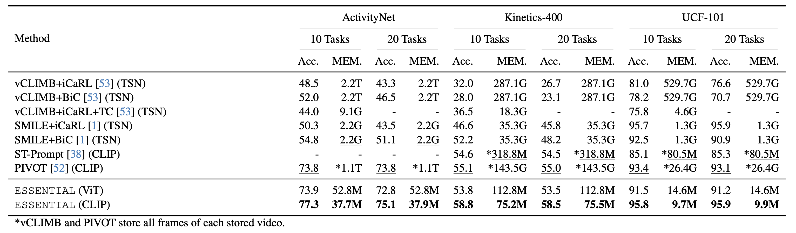
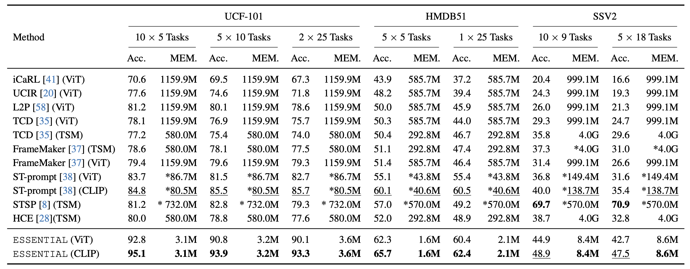
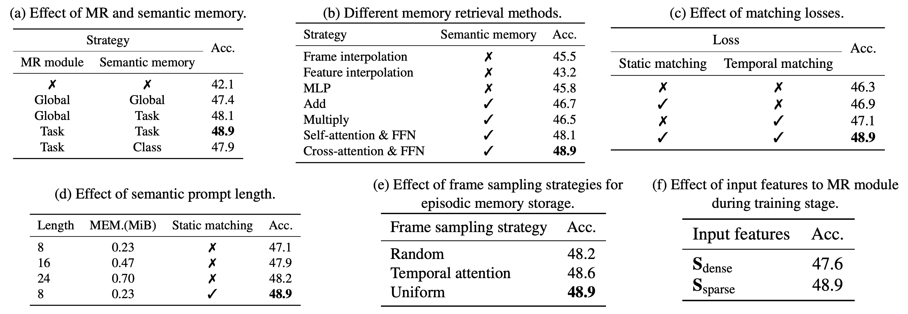

<!-- Using HTML to center the abstract -->
<div class="columns is-centered has-text-centered">
    <div class="column is-four-fifths">
        <h2>Abstract</h2>
        <div class="content has-text-justified">
In this work, we tackle the problem of video class-incremental learning (VCIL). Many existing VCIL methods mitigate catastrophic forgetting by rehearsal training with a few temporally dense samples stored in episodic memory, which is memory-inefficient. Alternatively, some methods store temporally sparse samples, sacrificing essential temporal information and thereby resulting in inferior performance. To address this trade-off between memory-efficiency and performance, we propose EpiSodic and SEmaNTIc memory integrAtion for video class-incremental Learning(ESSENTIAL). ESSENTIAL consists of episodic memory for storing temporally sparse features and semantic memory for storing general knowledge represented by learnable prompts. We introduce a novel memory retrieval (MR) module that integrates episodic memory and semantic prompts through cross-attention, enabling the retrieval of temporally dense features from temporally sparse features. We rigorously validate ESSENTIAL on diverse datasets: UCF-101, HMDB51, and Something-Something-V2 from the TCD benchmark and UCF-101, ActivityNet, and Kinetics-400 from the vCLIMB benchmark. Remarkably, with significantly reduced memory, ESSENTIAL achieves favorable performance on the benchmarks.
        </div>
    </div>
</div>

---
<!-- 
<div style="display: flex; justify-content: center; align-items: flex-start; gap: 0px;">
  
  <figure style="flex: 0 0 55%; text-align: center;">
    
    <figcaption style="font-size: 0.9em; color: gray; margin-top: 5px;">
      1. Performance-memory plot on the UCF-101 dataset from the TCD benchmark
    </figcaption>
  </figure>

  <figure style="flex: 0 0 44%; text-align: center;">
    
    <figcaption style="font-size: 0.9em; color: gray; margin-top: 5px;">
      2. MR module achieves a better performance-memory-efficiency trade-off.
    </figcaption>
  </figure>

</div>
 -->



## Motivation

ESSENTIAL is designed to overcome the trade-off in VCIL between **performance** and **memory-efficiency**. <br>
In Figure1, 

- 📉 **(a) Temporally dense features** stored in episodic memory yield high performance but suffer from **low memory-efficiency**.  
- 💾 **(b) Temporally sparse features** improve **memory-efficiency**, but lack of temporal context leads to **performance degradation**.  
- ⚖️ **(c) ESSENTIAL** combines the best of both: storing **temporally sparse features** and lightweight **semantic prompts** to maintain efficiency, while the **MR module** integrates episodic and semantic memory to reconstruct **temporally dense features**.

> The distance between the **retrieved feature vector** and the **original temporally dense feature vector** is significantly smaller than that between the **temporally sparse feature vector** and the **temporally dense feature vector**.

*By effectively retrieving temporal information from temporally sparse features, the MR module enables a high memory-efficiency-performance trade-off as demonstrated in **Figure 2**.*


## ESSENTIAL

The core philosophy of ***ESSENTIAL*** is to achieve a better trade-off between **memory-efficiency** and **performance** in video class-incremental learning.

1. **Reducing memory consumption**  
   We store only *temporally sparse* features in episodic memory, instead of *temporally dense* features, along with *lightweight* semantic prompts.

2. **Mitigating catastrophic forgetting**  
   To maintain high performance, the MR module retrieves *temporally dense* features during the rehearsal stage by applying cross-attention between *temporally sparse* features and semantic prompts.

3. **Training for effective retrieval**  
   The MR module is trained at each incremental stage to reconstruct temporally dense features using the stored *temporally sparse* features and semantic prompts as input.

## Architecture



### Visual and temporal feature extraction
ESSENTIAL uses a frozen visual encoder to obtain frame-level **temporally dense** features from the input video. These features are passed into a learnable temporal encoder, producing a clip-level representation that captures the video’s temporal dynamics.

---



### Memory Retrieval (MR) module 
The MR module is designed to reconstruct **temporally dense** features from stored **temporally sparse** features. It is trained with both static and temporal matching losses to ensure accurate retrieval. At its core, the MR module performs cross-attention between **learnable semantic prompts** and sparse features. Through training, the semantic prompts learn general knowledge, while the MR module learns to recover dense features using only sparse features and the prompts.

---



### Rehearsal training with retrieved features   
During rehearsal, the MR module integrates episodic memory and semantic memory via cross-attention, retrieving temporally dense features from temporally sparse features. These retrieved features are replayed for rehearsal training, allowing ESSENTIAL to mitigate catastrophic forgetting while maintaining high memory-efficiency.

### 📈 Experimental Results

<div align="center">

#### 📊 Comparison with the state-of-the-arts on the vCLIMB Benchmark
We report the Top-1 average accuracy (%) and the total memory usage (MiB).  
We indicate the backbone model in parentheses. The best are in **bold**, and the second best are _underscored_.  
A dash (-) denotes a value not reported in the original paper.  
**ESSENTIAL** achieves the best performance with minimal memory consumption across all datasets in the benchmark.



</div>

---

<div align="center">

#### 📊 Comparison with the state-of-the-arts on the TCD Benchmark
We report the Top-1 average incremental accuracy (%) and the total memory usage (MiB).  
We indicate the backbone model in parentheses. An asterisk (*) denotes estimated memory usage.  
The best are in **bold** and the second best are _underscored_.



</div>

---

<div align="center">

#### 🔍 Ablation study
We conduct extensive ablation studies to examine the design choices of the proposed method on the SSV2 (10 × 9 tasks).



</div>


## Citation
```
@article{turing1936computable,
  title={On computable numbers, with an application to the Entscheidungsproblem},
  author={Turing, Alan Mathison},
  journal={Journal of Mathematics},
  volume={58},
  number={345-363},
  pages={5},
  year={1936}
}
```
